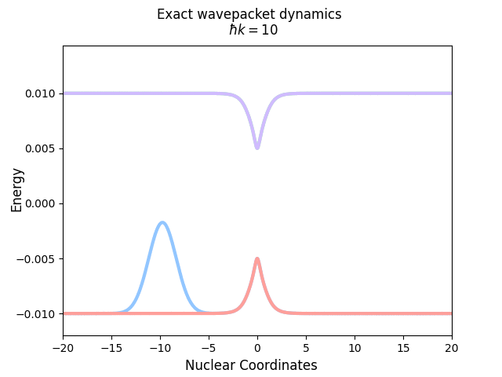
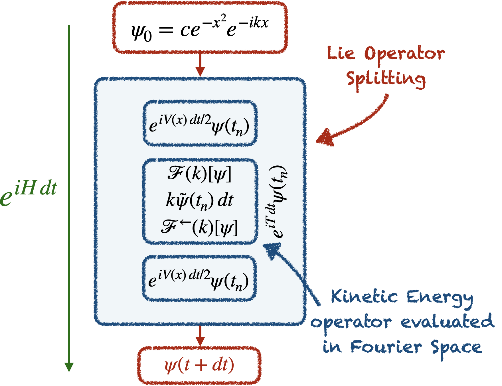

# WP_QuantumDynamics
Implementation of a general WavePacket Quantum Dynamics simulation for an arbitrary potential.

This code has been originally developed for benchmarking the seminal paper
Tully, J.C. _J. Chem. Phys._ (1990) *93* 1061.

## Notes on the implementation

The diabatic case is transformed into the adiabatic case, the Unitary time evolution operator is managed using the Trotter decomposition formula and the Kinetic Energy Operator is handled in the Fourier space.

# How to
How to use this small 1D wave packet code:

1. Compile:  `./compile.sh `

2. Run the program:  `./WPevolve_adiabatic_version-1.5.x < input.inp `

3. To plot the wave packet motion:  `python animate_WP_time-evolution.py `
   (This last step takes time, be patient!)

## Requirements
The full code has been written in  `Fortran 90/95`. 
Post analysis scripts are written in  `Python 3.7` and  `Julia`.

